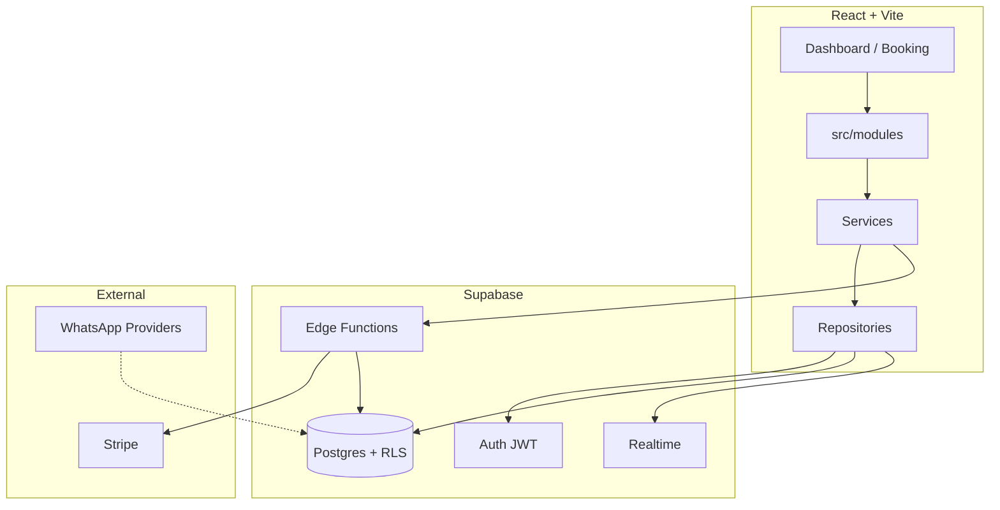

# Fadely — Backend Architecture

Production-grade SaaS backend on **Supabase** (Postgres + Auth + RLS + Realtime + Edge Functions) with **Stripe** billing and a pluggable **WhatsApp** provider layer.

## Architecture overview



## Multi-tenant model

| Concept | Table | Description |
|---------|--------|-------------|
| **Organization** | `organizations` | Billing root, Stripe customer, plan |
| **Establishment** | `businesses` | Salon/clinic unit (`organization_id`) |
| **Member** | `organization_members` | User ↔ org with `member_role` |
| **Staff record** | `employees` | Schedule entity; may link to `auth.users` |

Legacy installs used `businesses.owner_id` only. Migration `004` backfills `organizations` + `organization_members` and links `businesses.organization_id`.

**Isolation:** every tenant table is protected by **RLS**. Cross-tenant access returns zero rows. Permission checks use `has_business_permission(business_id, permission)` (SECURITY DEFINER, no recursion).

## Roles & permissions

| Role | Typical access |
|------|----------------|
| `owner` | Full access including billing |
| `admin` | Operations + settings; billing read-only |
| `manager` | Team, agenda, clients; no financial |
| `employee` | Own agenda + assigned clients |
| `receptionist` | Front-desk agenda + clients |

Permissions are stored in `role_permission_grants` and checked in RLS/RPCs. Client hints: `src/policies/permissions.ts`.

## Database migrations

Run in order in Supabase SQL Editor or via CLI:

1. `001_fadely_schema.sql` — core tables, base RLS
2. `002_employee_self_update.sql`
3. `003_fix_businesses_rls_recursion.sql`
4. `004_saas_multi_tenant.sql` — orgs, RBAC, payments, audit, WhatsApp queue
5. `005_rbac_rls_analytics.sql` — SaaS RLS, dashboard RPCs, Realtime

Generate TypeScript types:

```bash
npx supabase gen types typescript --project-id YOUR_REF > src/types/supabase.generated.ts
```

## Authentication flow

1. User signs up via Supabase Auth (`auth.service.ts`).
2. Trigger `handle_new_user` creates `profiles` row.
3. Onboarding calls RPC `create_organization_with_business` → org + business + `organization_members` (owner).
4. JWT is sent on every request; RLS uses `auth.uid()`.
5. Employees accept invite via `accept_invite` RPC (existing).

**Security:** never use `user_metadata` for authorization. Roles live in `organization_members` and `app_metadata` only if synced server-side.

## Stripe flow

1. Frontend: `stripeClient.createCheckout(plan, organizationId)` → Edge Function `stripe-checkout`.
2. User completes Checkout; Stripe sends webhook → `stripe-webhook`.
3. Webhook upserts `subscriptions` and updates `organizations.plan`.
4. Customer portal: `stripe-portal` Edge Function.

Deploy functions:

```bash
supabase functions deploy stripe-checkout
supabase functions deploy stripe-portal
supabase functions deploy stripe-webhook
supabase secrets set STRIPE_SECRET_KEY=sk_... STRIPE_WEBHOOK_SECRET=whsec_...
```

Configure webhook endpoint: `https://<project>.supabase.co/functions/v1/stripe-webhook`

## Plan feature gating

`plan_features` table + `src/policies/planFeatures.ts`:

| Plan | Employees | Locations | WhatsApp | Advanced analytics |
|------|-----------|-----------|----------|-------------------|
| free_trial | 3 | 1 | No | No |
| essential | 5 | 1 | Yes | No |
| professional | 15 | 3 | Yes | Yes |
| premium | 999 | 999 | Yes | Yes |

## Code structure

```
src/
  types/           # DTOs, enums, generated DB types
  validations/     # Zod schemas
  policies/        # Permissions + plan gates
  middleware/      # requireAuth, requirePermission, rateLimit
  repositories/    # Supabase data access
  services/        # Business logic
  integrations/    # Stripe, WhatsApp providers
  hooks/           # React Query + Realtime
  modules/         # Public barrel export
  repositories/db.js   # Legacy JS (gradual migration)
```

**Layers:** UI → Services → Repositories → Supabase. No raw queries in components for new code.

## Realtime

Published tables: `appointments`, `user_notifications`.

- `useRealtimeAppointments(businessId)` — live calendar
- `useNotifications(userId)` — in-app alerts

## WhatsApp

Messages are **queued** in `whatsapp_messages`. Provider implementations:

- Evolution API
- Twilio
- Z-API
- Meta Cloud API

Factory: `createWhatsAppProvider(config)`. Sending from the browser should only queue rows; a worker/Edge Function should call providers with secrets.

## Analytics RPCs

| RPC | Purpose |
|-----|---------|
| `get_dashboard_metrics` | Admin KPIs |
| `get_employee_dashboard_metrics` | Staff day view |
| `get_top_services` | Best sellers |
| `get_busiest_hours` | Peak hours |

## Audit

`log_audit(org_id, business_id, action, entity_type, ...)` — append-only `audit_logs`. Readable by roles with `audit:read`.

## Environment variables

See `.env.example`. Frontend only needs `VITE_*`. Secrets stay in Supabase Edge Function secrets.

## Deploy (Cloudflare Pages)

1. Build: `npm run build`
2. Set env vars in Cloudflare Pages dashboard
3. Run all SQL migrations on production Supabase
4. Deploy Edge Functions + Stripe webhook URL

## Conflict detection

`check_appointment_conflict(business_id, employee_id, start_at, end_at)` considers appointments + `blocked_time_slots`.

---

For incremental frontend migration, import from `@/modules` instead of `@/repositories/db.js` where TypeScript services exist.
